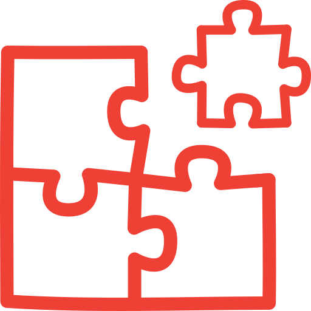

<p align="center">
  
</p>

<h1 align="center">dspy-community</h1>

<p align="center">
  The DSPy community meta-package — install <a href="https://github.com/stanfordnlp/dspy">DSPy</a> and curated community libraries in one go.
</p>

## Install

```bash
# Just DSPy
pip install dspy-community

# DSPy + all community libraries
pip install dspy-community[all]

# Pick what you need
pip install dspy-community[session,template-adapter]
```

## Included Libraries

| Extra | Package | Description |
|---|---|---|
| `session` | [dspy-session](https://github.com/dspy-community/dspy-session) | Multi-turn session wrapper — turn any module into a stateful conversation with optimizer-ready linearization |
| `template-adapter` | [dspy-template-adapter](https://github.com/dspy-community/dspy-template-adapter) | Exact-fidelity prompt templates with full control over messages |
| `profiles` | [dspy-profiles](https://github.com/nielsgl/dspy-profiles) | Configuration profiles via TOML files — switch between models, retrieval settings, and environments |

## Contributing

We welcome new libraries and projects to the DSPy community! See [CONTRIBUTING.md](CONTRIBUTING.md) for how to submit yours.

## License

MIT
